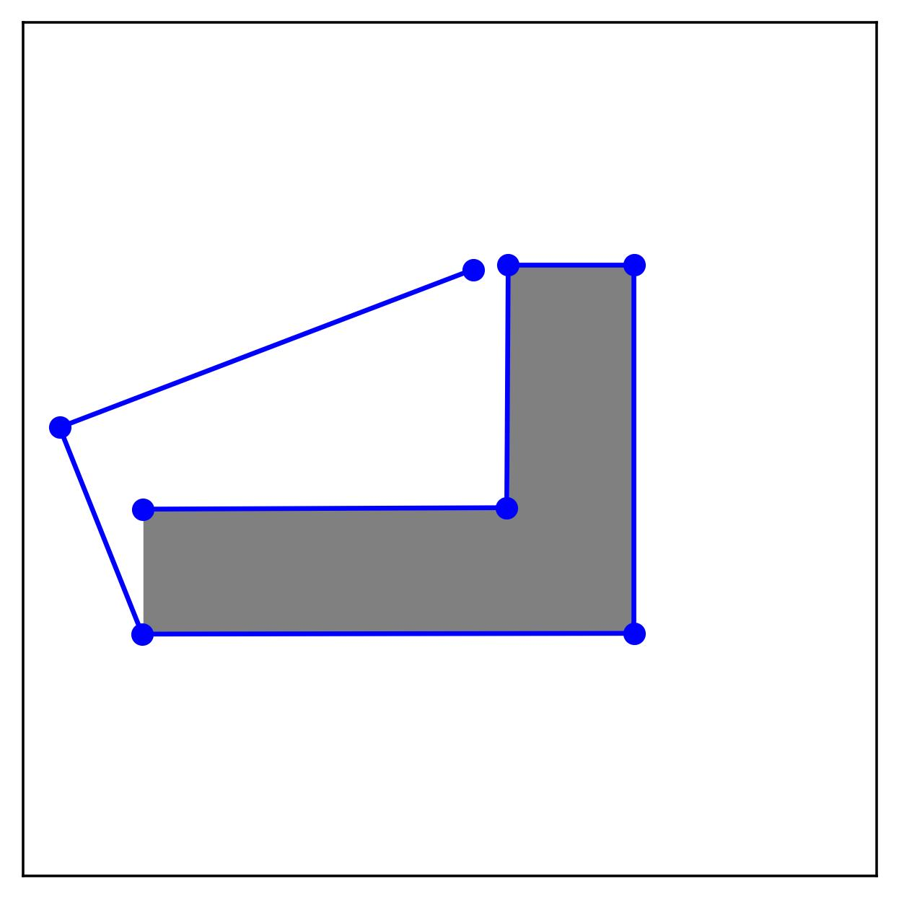

# (Multi-Agent) Hierarchal Constrained Reinforcement Learning

## Design custom evaluation problems for illustration
**Step 1**: generate a figure of the 2D maze

**Step 2**: load the image into [WebPlotDigitizer](https://apps.automeris.io/wpd/), manually align the x and y axes by selecting the start and end points. 

**Step 3**: pick the start and goal positions from the figure, click "View Data" button, copy the coords to a new file under [illustration_set](pud/envs/safe_pointenv/illustration_set) illustration following the specification [here](pud/envs/safe_pointenv/illustration_set/README.md).

## Coordinate Convention for 2D Maze

The maze is defined in numpy array. For example:
```python
L = np.array([[0, 0, 0, 0, 0, 0, 0],
              [0, 0, 1, 0, 0, 0, 0],
              [0, 0, 1, 0, 0, 0, 0],
              [0, 0, 1, 0, 0, 0, 0],
              [0, 0, 1, 1, 1, 0, 0],
              [0, 0, 0, 0, 0, 0, 0],
              [0, 0, 0, 0, 0, 0, 0]])
```

However, the visualization of this maze via matplotlib will display an L in a different orientation (e.g., CCW 90 deg). 



In our case, we don't bother it. If we really want to have the L shape in the vertical standup orientation, we change the maze definition in numpy array and rotate it CW 90 deg. The reason is to make the coords of visualization and points picked from visualization consistent with the internal maze coords. Although they look different due to different representation pipeline, they are internally the same thing. This make it easy to manually craft benchmark problems by selecting start and goal coords from the maze image (e.g., the dots and lines on the image above).

For detailed example and visualization, read [experiment slides](experiment_slides.pptx). 

Example code: [test_plot_orientation.py](pud/envs/safe_pointenv/unit_tests/test_plot_orientation.py).

## Coordinate Convention for Visual Navigation (HabitatCAD)

Again, we ignore any orientation discrepancy between the numpy array and visualization. The points taken from the visualization can be used as internal states without additional transformation.

Example code: [vis_handed_crafted_waypoints_w_topdown_maps in test_replica_cad_barebone.py](/run/media/me/SharedData/work/hrl/codes/cc-sorb-rev/pud/envs/safe_habitatenv/unit_tests/test_replica_cad_barebone.py)

Video proof of matching coordinate: [trace_bounds.mp4 -- trace map bounds by manual point selection](README_RES/trace_bounds.mp4)
<!--<video src="README_RES/trace_bounds.mp4" width="300" />-->

## Train with visual inputs
```bash
sbatch launch_jobs/cloud_debug_vec_habitat.sh # on MIT supercloud GPU node
bash launch_jobs/local_debug_vec_habitat.sh # locally, may not work due to memory limit
```
**Important**: The base SORB algorithm is sensitive to random seeds. This is undocumented in the original SORB paper. Consequently, training with vectorized env will not converge. Make sure to set the num_envs to 1 in vec training. In addition, the replay buffer size seems to matter as well. Currently, only training on MIT Supercloud with a experience replay buffer size of 100K has been proven to work.  

## Installing habitat-sim
**Step 1**:
```bash
conda install habitat-sim -c conda-forge -c aihabitat

## Optional: install habitat-lab
git clone --branch stable https://github.com/facebookresearch/habitat-lab.git
cd habitat-lab
pip install -e habitat-lab  # install habitat_lab

# if see xcb error, uninstall PyQt5 and reinstall opencv-python 
# https://stackoverflow.com/questions/71088095/opencv-could-not-load-the-qt-platform-plugin-xcb-in-even-though-it-was-fou
```
**Step 2**:
### Download (testing) 3D scenes
```bash
python -m habitat_sim.utils.datasets_download --uids habitat_test_scenes --data-path /path/to/data/
```
### Download example objects
```bash
python -m habitat_sim.utils.datasets_download --uids habitat_example_objects --data-path /path/to/data/
```

### Setup Replica CAD (Not Replica Dataset)
Replica CAD is a simpler and painless version of Replica Dataset. Replica Dataset may have been deprecated: see [Github Issue](https://github.com/facebookresearch/habitat-sim/issues/2335)

```bash
target_dir=external_data/replica_cad # feel free to change
GIT_CLONE_PROTECTION_ACTIVE=false python -m habitat_sim.utils.datasets_download --uids replica_cad_dataset replica_cad_baked_lighting --data-path $target_dir
```

Verify it is working with interactive viewer
```bash
habitat-viewer --dataset ${target_dir}/replica_cad_baked_lighting/replicaCAD_baked.scene_dataset_config.json -- sc1_staging_00
```

## Setup on Supercloud
Habitat only works on GPU node (at least I did not get CPU nodes to work). The setup process, however, takes place on the initial login node without access to GPU. Load the necessary module to install cuda-enabled pytorch without access to GPU/CUDA.
```bash
module load anaconda/2023a-pytorch
module load cuda/11.8
module load nccl/2.18.1-cuda11.8
```

Installation on Supercloud requires creating a custom conda environment. Note this will reduce the I/O speed because the user space locates on network drive. 
```bash
conda create -n habitat python=3.9 cmake=3.14.0
source activate habitat
```

Install cuda-compatible pytorch
```bash
conda install pytorch torchvision torchaudio pytorch-cuda=11.8 -c pytorch -c nvidia
```

Install Habitat (this step takes a long time)
```bash
conda install habitat-sim headless -c conda-forge -c aihabitat
```

Setup of ReplicadCAD follows the same procedure as above.

## Experimental Design
see [slides](experiment_slides.pptx)


# Sparse Graphical Memory (SGM) and Search on the Replay Buffer (SoRB) in PyTorch

## Example usage
```
pip install -e .

python run_PointEnv.py configs/config_PointEnv.py
```

## Results

### SoRB (re-planning with closest waypoint) trajectory visualization


```
policy: no search
start: [0.03271197 0.99020872]
goal: [0.81310241 0.028764  ]
steps: 300
----------
policy: search
start: [0.03271197 0.99020872]
goal: [0.81310241 0.028764  ]
steps: 127
```

### SoRB (open loop planning) trajectory visualization


```
policy: no search
start: [0.03271197 0.99020872]
goal: [0.81310241 0.028764  ]
steps: 300
----------
policy: search
start: [0.03271197 0.99020872]
goal: [0.81310241 0.028764  ]
steps: 111
```

### State graph visualization 

1. SoRB state graph (per critic in ensemble)


2. SGM state graph (ensembled)
<!--  -->
<p align="center"></p>

```
Initial SparseSearchPolicy (|V|=202, |E|=1894) has success rate 0.20, evaluated in 14.26 seconds
Filtered SparseSearchPolicy (|V|=202, |E|=986) has success rate 0.80, evaluated in 8.44 seconds
Took 10000 cleanup steps in 84.45 seconds
Cleaned SparseSearchPolicy (|V|=202, |E|=955) has success rate 1.00, evaluated in 6.69 seconds
```

## Credits
* https://github.com/scottemmons/sgm
* https://github.com/google-research/google-research/tree/master/sorb
* https://github.com/sfujim/TD3

## References
[1]: Michael Laskin, Scott Emmons, Ajay Jain, Thanard Kurutach, Pieter Abbeel, Deepak Pathak, ["Sparse Graphical Memory for Robust Planning"](https://arxiv.org/abs/2003.06417), 2020.

[2]: Benjamin Eysenbach, Ruslan Salakhutdinov, Sergey Levine, ["Search on the Replay Buffer: Bridging Planning and Reinforcement Learning"](https://arxiv.org/abs/1906.05253), 2019.

